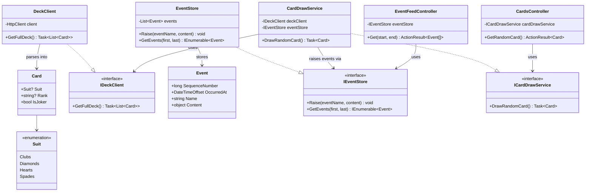
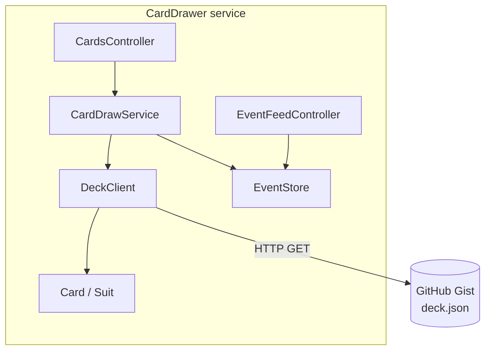

# diplom-storesys-card-drawer

Microservice that draws a random card from a full deck (52 cards + 3 jokers), fetched from a static deck source. Built for the "Udvikling af store systemer" module on the Diplomuddannelse i softwareudvikling, based on the microservice patterns from *Microservices in .NET* (2nd ed.) by Christian Horsdal Gammelgaard.

## Assignment

Week 2 / chapter 2 deliverable. The service exposes a single HTTP endpoint that returns a randomly drawn card as JSON, with equal probability for every card in the deck.

## Architecture

The service follows the flat project structure used in chapter 2 of the book (see the [`book-reference/flat-structure`](https://github.com/anit3k/diplom-storesys-shopping-cart/tree/book-reference/flat-structure) branch of [diplom-storesys-shopping-cart](https://github.com/anit3k/diplom-storesys-shopping-cart) for the reference implementation), rather than a layered Clean Architecture split.

- **Deck source**: a static JSON file (GitHub Gist) containing the full 55-card deck, acting as the "fake card-deck microservice" the way the book's product catalog example uses a static file on GitHub.
- **CardDrawer service**: fetches the deck from the gist via a typed `HttpClient` (`DeckClient`/`IDeckClient`), then draws one card uniformly at random via `CardDrawService`/`ICardDrawService`, and returns it through its own HTTP endpoint (`CardsController`).
- **Event store**: an in-memory `IEventStore`/`EventStore`, following the book's chapter 2 event feed pattern — every card draw raises a `CardDrawn` event, exposed to other microservices via a `GET /events` endpoint on `EventFeedController`.

```
src/CardDrawer/
├── Card.cs                  domain model (Suit, Rank, IsJoker)
├── IDeckClient.cs            interface for fetching the deck
├── DeckClient.cs              HTTP client implementation, calls the gist
├── ICardDrawService.cs        interface for drawing a card
├── CardDrawService.cs          draws a uniformly random card, raises a CardDrawn event
├── CardsController.cs        HTTP endpoint (GET /cards/random)
├── Event.cs                  event feed model (SequenceNumber, OccurredAt, Name, Content)
├── IEventStore.cs             interface for raising/reading events
├── EventStore.cs               in-memory event store implementation
├── EventFeedController.cs    HTTP endpoint (GET /events)
├── Program.cs
├── appsettings.json
└── CardDrawer.csproj
```

## Running locally

```powershell
cd src\CardDrawer
dotnet run
```

The service listens on:
- HTTP: `http://localhost:5054`
- HTTPS: `https://localhost:7003`

Then request a random card:

```powershell
curl https://localhost:7003/cards/random
```

Example response:

```json
{ "suit": "Hearts", "rank": "Queen", "isJoker": false }
```

You can then check the event feed for the CardDrawn events this generated:
 
```powershell
curl "https://localhost:7003/events?start=0&end=100"
```

A Postman collection (`CardDrawer.postman_collection.json`) is included for manual testing — remember to set the `baseUrl` variable to match the port above.

## Tech stack

- .NET 10
- ASP.NET Core MVC (controllers, not minimal APIs — to match the book's approach)
- JetBrains Rider

## AI-assisted development

Parts of this project (planning, code review, and boilerplate scaffolding) were developed with assistance from Claude (Anthropic). AI was used as a pair-programming aid — for discussing architectural trade-offs, reviewing code the author wrote, and generating small, well-understood boilerplate (e.g. Postman collection, gist deck data) — not for producing the final domain logic unreviewed. All code was written and understood by the author as part of the learning objective for this module.

## Class diagram



## Package diagram



## Related repositories

- [diplom-storesys-shopping-cart](https://github.com/anit3k/diplom-storesys-shopping-cart) — the ShoppingCart/ProductCatalog reference implementation this project's flat structure is modeled after.