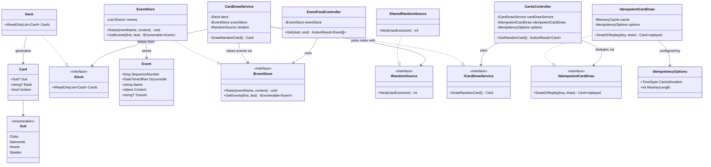

# Class diagram (CardService)

The main types in CardService and how they relate.

```mermaid
classDiagram
  class Suit {
    <<enumeration>>
    Clubs
    Diamonds
    Hearts
    Spades
  }
  class Card {
    +Suit? Suit
    +string? Rank
    +bool IsJoker
  }
  class IDeck {
    <<interface>>
    +IReadOnlyList~Card~ Cards
  }
  class Deck {
    +IReadOnlyList~Card~ Cards
  }
  class Event {
    +long SequenceNumber
    +DateTimeOffset OccurredAt
    +string Name
    +object Content
    +string? TraceId
  }
  class IEventStore {
    <<interface>>
    +Raise(eventName, content) void
    +GetEvents(first, last) IEnumerable~Event~
  }
  class EventStore {
    -List~Event~ events
    +Raise(eventName, content) void
    +GetEvents(first, last) IEnumerable~Event~
  }
  class IRandomSource {
    <<interface>>
    +Next(maxExclusive) int
  }
  class SharedRandomSource {
    +Next(maxExclusive) int
  }
  class ICardDrawService {
    <<interface>>
    +DrawRandomCard() Card
  }
  class CardDrawService {
    -IDeck deck
    -IEventStore eventStore
    -IRandomSource random
    +DrawRandomCard() Card
  }
  class IIdempotentCardDraw {
    <<interface>>
    +DrawOrReplay(key, draw) Card+replayed
  }
  class IdempotentCardDraw {
    -IMemoryCache cache
    -IdempotencyOptions options
    +DrawOrReplay(key, draw) Card+replayed
  }
  class IdempotencyOptions {
    +TimeSpan CacheDuration
    +int MaxKeyLength
  }
  class CardsController {
    -ICardDrawService cardDrawService
    -IIdempotentCardDraw idempotentCardDraw
    -IdempotencyOptions options
    +GetRandomCard() ActionResult~Card~
  }
  class EventFeedController {
    -IEventStore eventStore
    +Get(start, end) ActionResult~Event[]~
  }

  Deck ..|> IDeck
  EventStore ..|> IEventStore
  CardDrawService ..|> ICardDrawService
  SharedRandomSource ..|> IRandomSource
  IdempotentCardDraw ..|> IIdempotentCardDraw
  CardDrawService --> IDeck : draws from
  CardDrawService --> IEventStore : raises events via
  CardDrawService --> IRandomSource : picks index with
  CardsController --> ICardDrawService : uses
  CardsController --> IIdempotentCardDraw : dedupes via
  IdempotentCardDraw --> IdempotencyOptions : configured by
  EventFeedController --> IEventStore : uses
  EventStore --> Event : stores
  Deck --> Card : generates
  Card --> Suit
```
