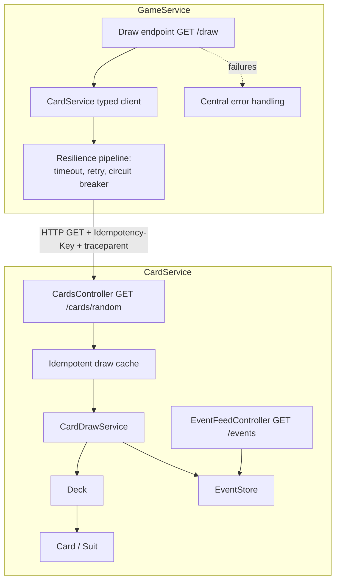

# Package diagram

How GameService and CardService are structured and how a draw flows between them.

```mermaid
flowchart TB
    subgraph GameService
        GameController[Draw endpoint GET /draw]
        CardClient[CardService typed client]
        Pipeline[Resilience pipeline:<br/>timeout, retry, circuit breaker]
        ErrorHandler[Central error handling]
    end
    subgraph CardService
        Controller[CardsController GET /cards/random]
        EventController[EventFeedController GET /events]
        Idempotency[Idempotent draw cache]
        AppService[CardDrawService]
        LocalDeck[Deck]
        Store[EventStore]
        Domain[Card / Suit]
    end

    GameController --> CardClient
    CardClient --> Pipeline
    Pipeline -- "HTTP GET + Idempotency-Key + traceparent" --> Controller
    GameController -. failures .-> ErrorHandler
    Controller --> Idempotency
    Idempotency --> AppService
    AppService --> LocalDeck
    AppService --> Store
    EventController --> Store
    LocalDeck --> Domain
```
